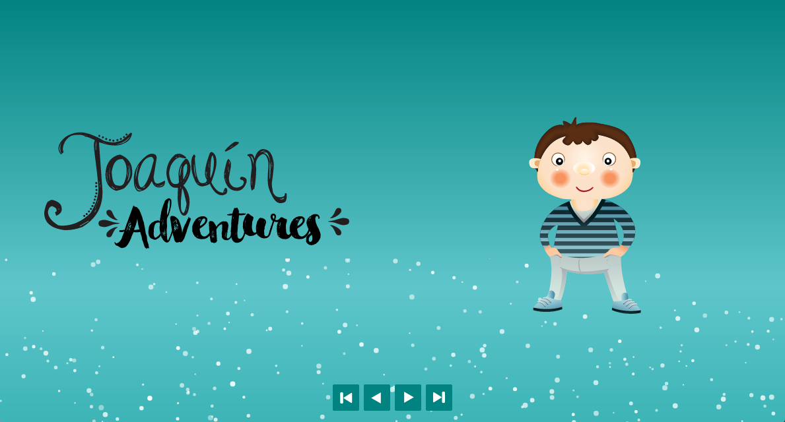
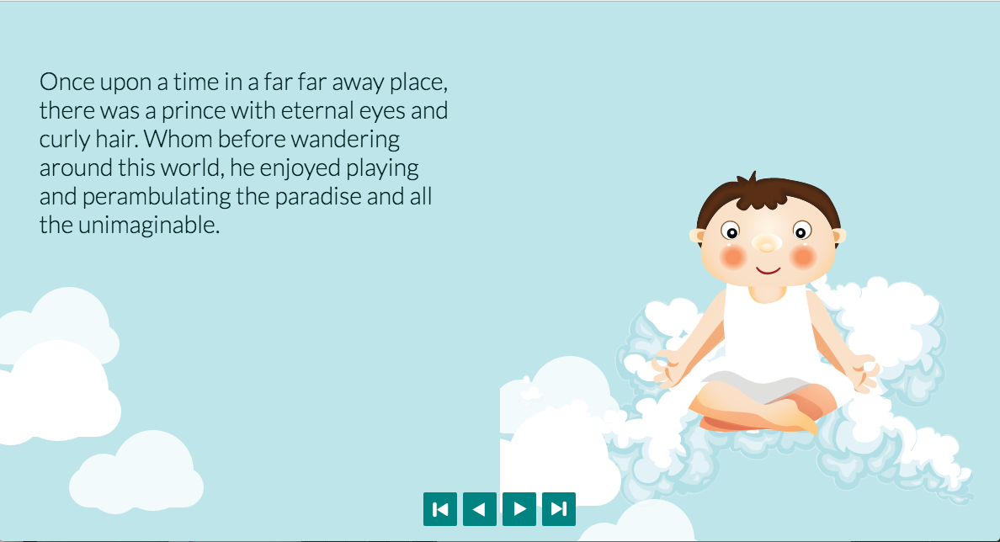
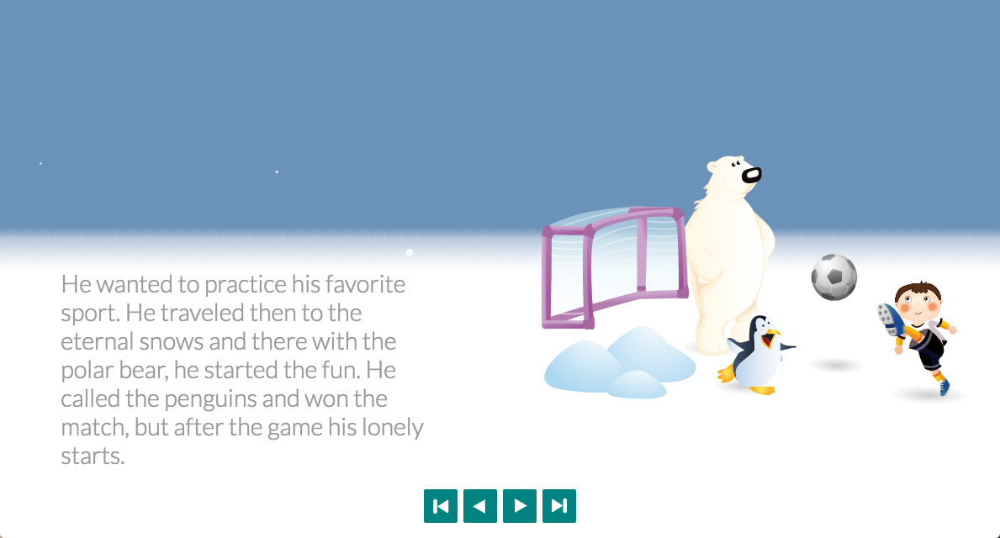
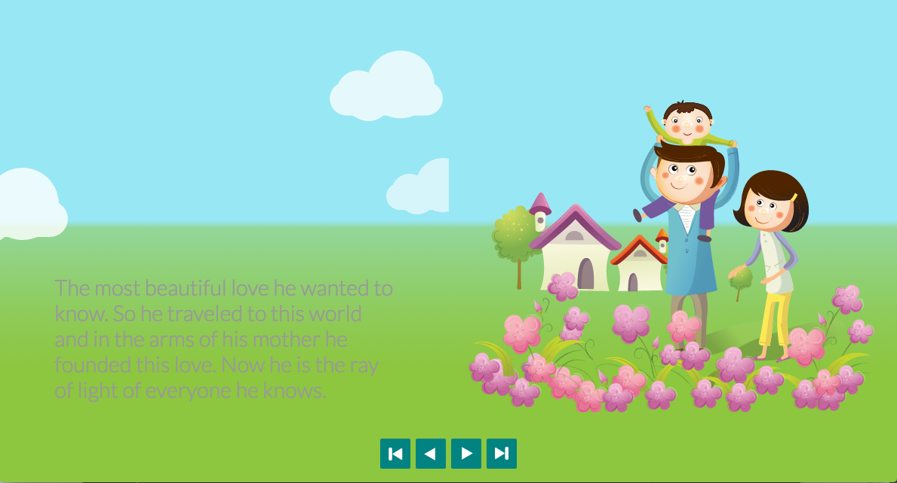

# Final Assignment

For this final Assigment I did an animated storytelling using javascript and styles. I used different libraries in Javascript to use SVG files to work with illustrations. I use the tutorial to create a flip book and inside each page the story changes. Is a fairy Tale about my nephew.

https://web-advanced-fall-2016.github.io/final-project-racuelcer/

#### Front End

##### Libraries

* To libraries used were Jquery, TweenLie

I use this library to do the animations to fade in.

##### Tutorials

I used Javascript tutorials and SVG to could create the animatioins besides the animations are triggered from JavaScript calling the CSS animation.

-Animating Multiple Objects - #5 - GreenSock 101
- SVG ANIMATION

### Animation
The story animate in each page using the canvas and styles.

In this page the animation is for the background and for each image with TweenLite.

In this page the animation is with css for the clouds

In this page the animation is with canvas and particles for the snow

In this page I reuse the clouds animation.

